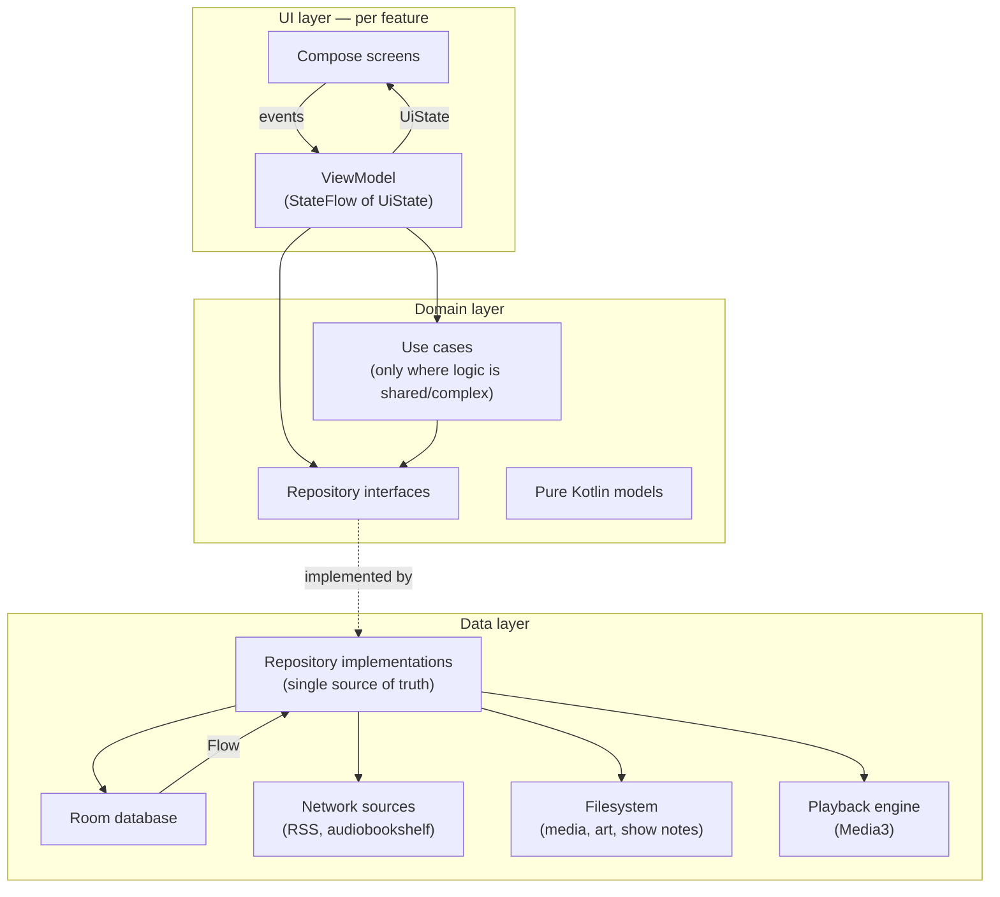
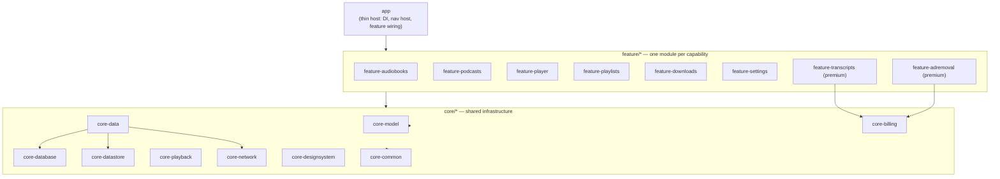
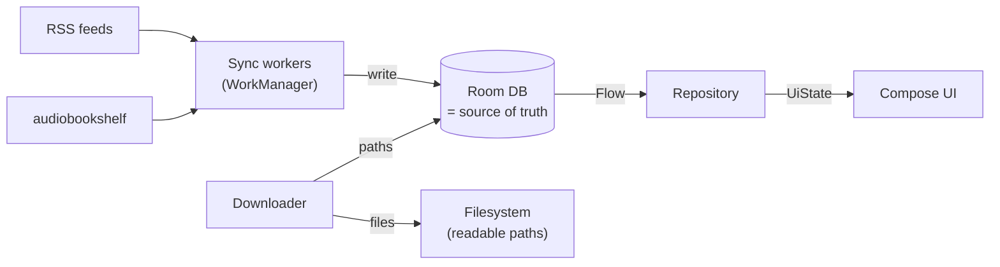
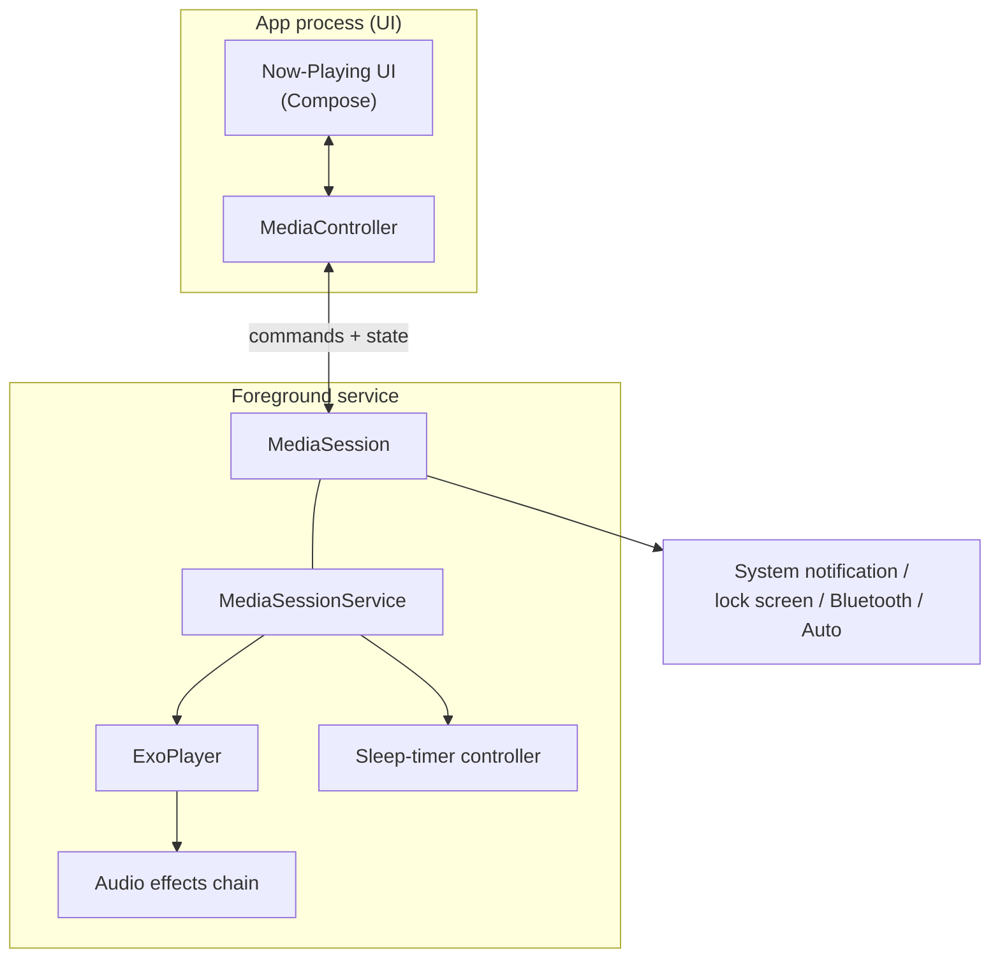
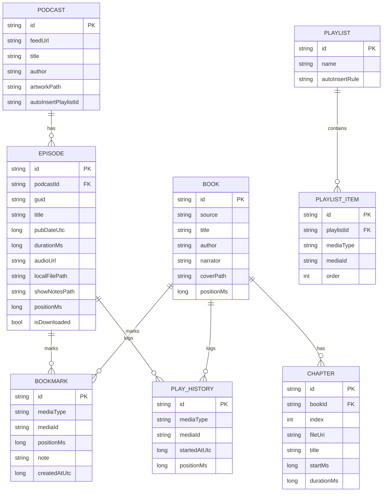
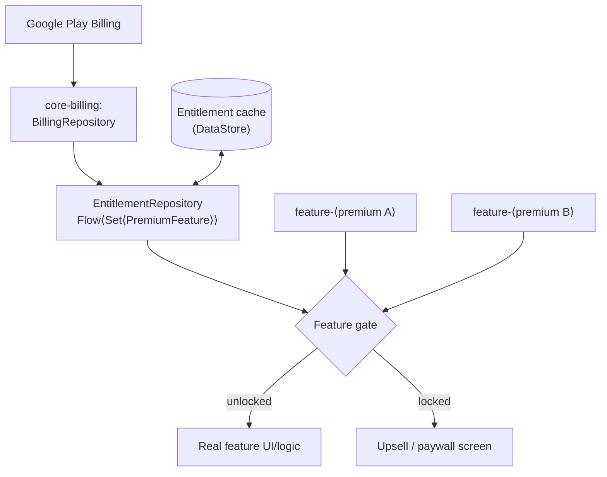

# Orator — Architecture Plan

> A lightweight, modular Android player for **podcasts** and **audiobooks**.
> This document is the architectural blueprint to review *before* feature work begins.
> Status: **proposed** (2026-06-09). Stack baseline already in place: Kotlin + Jetpack Compose, minSdk 26 / target 35, Gradle 8.11.1.

[TOC]

---

## 1. Guiding principles

Every decision in this document traces back to one of four principles. The first three come
straight from `initial_plan.md`; the fourth is derived from "download and store locally" plus
the demand to be "quick and responsive."

| # | Principle | What it means in practice |
|---|-----------|---------------------------|
| **P1** | **Lightweight** | Small APK, fast cold start, minimal dependencies. Every library must earn its place. Prefer platform APIs over third-party where the gap is small. |
| **P2** | **Modular** | A feature is a *module* that plugs into a registry. Adding or removing a feature = adding or removing one Gradle dependency + one DI binding. No feature reaches into another. |
| **P3** | **Paywall-ready** | Premium capability is gated behind an *entitlement* check resolved in one place. A feature does not know *how* it is paid for — only whether it is unlocked. |
| **P4** | **Offline-first (derived)** | The local database + filesystem are the single source of truth. The UI only ever reads local state. Network (RSS, audiobookshelf) is a background *sync input*, never a thing the UI blocks on. |

These are in tension sometimes (e.g. modularity adds module boilerplate, which fights
lightness). Where they conflict, the ranking is **P1 ≈ P4 > P2 > P3**: never sacrifice
responsiveness or correctness for module purity, and don't build billing scaffolding before
there's something worth selling.

---

## 2. High-level architecture

Orator uses the **official Android app architecture** (UI → Domain → Data) with **unidirectional
data flow**, expressed across a **multi-module** graph. It is deliberately *pragmatic* Clean
Architecture: layered and testable, but without ceremony (no use-case class for a one-line
pass-through).



**Reading the diagram:** data flows *up* as immutable `UiState` (a `StateFlow`), events flow
*down* as function calls. The repository is the only thing that talks to data sources, and the
**Room DB emits `Flow`s** that the repository forwards — so when a background download or RSS
refresh writes to the DB, the UI updates automatically. That is P4 in one picture.

### Why this shape

- **Testability:** ViewModels and use cases depend on repository *interfaces*, so tests inject
  fakes — no Android, no network, no disk.
- **Responsiveness (P1/P4):** the UI never awaits the network. It renders whatever is in Room
  *now*, and re-renders when sync lands.
- **It is the documented default**, which means the most community examples, the least
  bespoke glue, and the easiest onboarding for future contributors.

---

## 3. Module structure

This is the **target** graph. We do **not** build all of it on day one (see the
[roadmap](#15-delivery-roadmap)) — but establishing the conventions now means each new feature
slots in the same way.



**Dependency rule:** `app → feature → core`, and **never** the reverse, and **never**
`feature → feature`. Features share *only* through `core`. This is what makes a feature
deletable: nothing downstream imports it.

### Module responsibilities

| Module | Responsibility | Key deps |
|--------|----------------|----------|
| `app` | Application class, DI graph root, single-Activity nav host, aggregates feature registries. Stays *thin*. | all features |
| `core-common` | Coroutine dispatchers, `Result`/error types, time utilities. Mostly pure Kotlin. | — |
| `core-model` | Domain models: `Episode`, `Podcast`, `Book`, `Chapter`, `Bookmark`, `Playlist`, `MediaRef`. Pure Kotlin, no Android. | — |
| `core-database` | Room entities, DAOs, type converters, migrations. | Room |
| `core-datastore` | Typed settings (playback speeds, theme, sleep-timer defaults) via DataStore. | DataStore |
| `core-network` | OkHttp client, RSS/Atom parser, audiobookshelf API client, artwork/show-notes fetchers. | OkHttp, kotlinx.serialization |
| `core-data` | Repository implementations that fuse DB + network + filesystem into the single source of truth. Exposes repository interfaces consumed by features. | core-database, core-network, core-datastore |
| `core-playback` | Media3 `MediaSessionService`, the player, audio effects (speed, silence-skip, loudness), sleep timer, position persistence. | Media3 |
| `core-designsystem` | Compose theme, color/typography tokens, reusable components (buttons, artwork, scrubber). No domain knowledge. | Compose |
| `core-billing` | Play Billing wrapper + `EntitlementRepository`. The single place "is this unlocked?" is answered. | Play Billing |
| `feature-*` | One user-facing capability each: its ViewModels, Compose screens, and a nav graph it registers. | relevant core modules |

> **Note on granularity (P1 vs P2):** a 17-module graph is a maintenance cost. We start with
> ~5 modules and split *when a seam actually hurts*, not preemptively. The table is the
> destination, not the first commit.

---

## 4. Cross-cutting patterns

### 4.1 Unidirectional data flow (UDF / MVI-lite)

Each screen has a ViewModel exposing a single immutable state:

```kotlin
data class LibraryUiState(
    val isLoading: Boolean = true,
    val books: List<BookUi> = emptyList(),
    val error: String? = null,
)

class LibraryViewModel(repo: AudiobookRepository) : ViewModel() {
    val uiState: StateFlow<LibraryUiState> =
        repo.observeBooks()
            .map { LibraryUiState(isLoading = false, books = it.toUi()) }
            .stateIn(viewModelScope, SharingStarted.WhileSubscribed(5_000), LibraryUiState())

    fun onEvent(e: LibraryEvent) { /* user intents in */ }
}
```

`WhileSubscribed(5_000)` keeps the upstream flow alive across config changes but tears it down
when the screen is truly gone — a small but real P1 win (no orphaned collectors).

### 4.2 Single source of truth / offline-first (P4)



The UI subscribes to Room. Anything that changes data — a finished download, a new episode
from a feed refresh, a progress sync from audiobookshelf — *writes to Room*, and the UI reacts.
No screen ever shows a spinner waiting on a network call for content it already has.

### 4.3 Dependency injection — **Hilt** (recommended)

DI is the mechanism that makes modules pluggable. **Recommendation: Hilt**, because:

- First-class Compose (`hiltViewModel()`), WorkManager (`@HiltWorker`), and `MediaSessionService` support.
- **Multibindings (`@IntoSet`)** are exactly the primitive we need for the feature registry (§4.4).
- Compile-time validation catches wiring mistakes before runtime.

*Trade-off (P1):* Hilt adds annotation processing and some build time. The lightweight
alternative is **Koin** (runtime, Kotlin-DSL, no codegen). If build times become painful as the
module count grows, Koin is the fallback. **Decision needed** — see [open questions](#16-open-questions-for-you).

### 4.4 The feature registry — how modularity actually works (P2)

This is the keystone pattern. Each feature module contributes a `FeatureEntry` describing how it
plugs into navigation, via a Hilt multibinding:

```kotlin
// in core (the contract)
interface FeatureEntry {
    val route: String
    val navItem: NavItem?            // null = no top-level nav entry
    fun NavGraphBuilder.register(navController: NavController)
}

// in feature-podcasts
@Module @InstallIn(SingletonComponent::class)
object PodcastsFeatureModule {
    @Provides @IntoSet
    fun entry(): FeatureEntry = PodcastsEntry()
}

// in app — knows nothing about any specific feature
@Composable
fun OratorNavHost(entries: Set<@JvmSuppressWildcards FeatureEntry>) {
    NavHost(navController, startDestination = Home.route) {
        entries.forEach { with(it) { register(navController) } }
    }
}
```

**To add a feature:** create the module, implement `FeatureEntry`, add the dependency to `app`.
**To remove it:** delete the module and the `app` dependency line. The nav host, the bottom bar,
and every other feature are untouched. That is P2, enforced by the compiler.

### 4.5 Navigation

Single-Activity, **Navigation-Compose** with type-safe (`@Serializable`) routes. Each feature owns
its own nav sub-graph and exposes it through `FeatureEntry`. Deep links (for "navigate linked
timestamps" in show notes and for notification taps) are declared per-destination.

### 4.6 Error & result handling

`core-common` defines a small `Result`-like type. Repositories never throw across the boundary;
they return typed outcomes. Network/IO errors surface as recoverable `UiState.error` with retry,
never as crashes — important because feeds and servers are flaky by nature.

---

## 5. Playback subsystem — the core of the app

Playback is the one subsystem every feature depends on, so it gets the most rigor. It is built on
**Jetpack Media3** (the maintained successor to ExoPlayer).



### Why a `MediaSessionService`

A background-capable, OS-integrated session is non-negotiable for an audio app: lock-screen
controls, Bluetooth/headset buttons, Android Auto, and *playback that survives the UI being
swiped away*. Media3's `MediaSession` gives all of this for free and is the platform-blessed path.
The UI binds a `MediaController` to it; the controller mirrors player state as observable flows
that drive the Now-Playing screen.

### Feature-by-feature mapping to Media3

| Requirement | Mechanism | Risk |
|-------------|-----------|------|
| Play `.m4b` + `.mp3` collections | Media3 progressive extractors; an mp3 "book" = a playlist of tracks where each file is a chapter | Low |
| Stream from audiobookshelf | Media3 plays HTTP(S) URIs with an auth header data-source factory | Low |
| **Playback speed** (global + per type + per item) | `player.setPlaybackSpeed()`; resolve effective speed at load time from DataStore (item ▸ type ▸ global) | Low |
| **Silence trimming** | Media3 `SilenceSkippingAudioProcessor` enabled on a custom `RenderersFactory` | Low |
| **Volume boost** | `LoudnessEnhancer` (platform `audiofx`) bound to the player's audio session id; gain in millibels, with clipping safeguards | Med |
| **Sleep timer** (duration *or* boundary) | Service-side controller: a coroutine for duration; for "end of episode/chapter," watch transition events and pause at the boundary; optional fade-out | Low |
| **Resume / positions** | Persist position on pause/stop/transition to Room; restore on load | Low |
| **Chapters** (m4b) | Media3 surfaces some metadata; robust m4b chapter marks may need explicit MP4 atom parsing | **Med-High** — spike early |
| **Play history** | Session listener writes history rows on start/complete | Low |

> **Honest flag:** m4b chapter extraction is the one playback item that is *not* a solved,
> one-line API. Plan a short spike in Phase 2 to confirm whether Media3's metadata is sufficient
> or whether we need a small MP4 atom (`chpl`/`chap`) parser. Everything else above is
> well-trodden Media3 territory.

### Effective-speed resolution (example of "per type and per item")

```
effectiveSpeed(item) =
    item.speedOverride            // if the user set a speed for this exact file
    ?: typeDefault[item.type]     // else the podcast-vs-audiobook default
    ?: globalSpeed                // else the global default
    ?: 1.0
```

This little resolver lives in `core-playback` and is pure/unit-testable.

---

## 6. Data layer & persistence

**Room** is the source of truth for *metadata and state*; the **filesystem** holds *bytes*
(audio, artwork, show-notes HTML) at human-readable paths (P1 from the plan: "human readable
formats"), e.g. `Orator/Podcasts/<Show>/<Episode>/`. Room stores the path; the file is
findable by a human with a file browser. **DataStore** holds preferences.

**Storage location (decided 2026-06-09): a user-visible shared folder** chosen via the Storage
Access Framework (tree URI), *not* app-private storage. Files survive uninstall and are
browsable/back-up-able by the user. The data layer works in `DocumentFile`/SAF URIs rather than
raw `File` paths.

**Caching policy (decided 2026-06-09): aggressive.** Everything *except* the audio file — show
notes, artwork, transcripts, chapter JSON — is cached locally in the per-show/per-episode
directory tree at subscribe/refresh time. The library UI **never waits on the network**;
discovery/search is the only inherently-online interaction.



### The unifying idea: `MediaRef`

Playlists mix podcasts and audiobooks, so we need *one* way to point at "a playable thing." A
`MediaRef(type: MediaType, id: String)` is that pointer. `PLAYLIST_ITEM`, `BOOKMARK`, and
`PLAY_HISTORY` all store `(mediaType, mediaId)` rather than a hard foreign key, which is what lets
a single playlist hold an episode followed by an audiobook chapter. The repository resolves a
`MediaRef` to a concrete `Episode`/`Chapter` for playback.

---

## 7. Feature designs

### 7.1 Podcasts (`feature-podcasts` + `core-network`)

- **Discovery / search (decided 2026-06-09).** Browse-for-new-podcasts uses the
  **Podcast Index API** (free key, open directory) as primary and the **iTunes Search API**
  (no key) as fallback. Discovery is fully decoupled: it only *yields a feed URL* into the
  normal RSS subscribe flow below, so it can be removed or swapped without touching anything.
- **Subscribe via RSS.** A focused parser built on Android's `XmlPullParser` (no heavyweight RSS
  library — P1) handling RSS 2.0 + the `itunes:`, `content:encoded`, and **Podcasting 2.0
  (`podcast:`)** namespaces. The `podcast:` namespace matters: it carries `<podcast:transcript>`
  and `<podcast:chapters>`, which feed the transcript and show-notes-navigation features
  *without any ML*.
- **Download + store locally** at readable paths via the downloader (§9), recorded in Room.
- **Artwork**: show- and episode-level images fetched and cached to the filesystem.
- **Show notes**: `content:encoded` HTML stored locally; rendered to Compose. We parse it for
  (a) `hh:mm:ss` timestamps and (b) anchor links, turning timestamps into **seek actions** and
  links into deep-links/browser intents. Podcasting 2.0 `<podcast:chapters>` (JSON) gives
  structured "embedded sections" to jump between.

### 7.2 Audiobooks (`feature-audiobooks`)

- **Local files**: the user picks a directory via SAF (tree URI); the importer scans it and
  reads tags, duration, embedded cover, and chapters via `MediaMetadataRetriever`
  (m4b chapters: see the spike flag in §5). An mp3-collection book = ordered files → `CHAPTER` rows.
- **audiobookshelf**: `core-network` client logs in, lists libraries/items, fetches covers, and
  **syncs progress both ways** (ABS has a progress API) so position is consistent across devices.
  A `BookSource` abstraction (`LOCAL` | `ABS`) keeps the feature UI identical regardless of origin.
  **ABS is a launch feature, not a fast-follow** (decided 2026-06-09).
- **Bookmarks**: a `BOOKMARK` row at a position with an optional note; listed for review and
  tappable to seek.

### 7.3 Playlists (`feature-playlists`)

- Ordered `PLAYLIST_ITEM`s of mixed `MediaRef`s.
- **Auto-insert rules** (`autoInsertRule` on the playlist, plus `autoInsertPlaylistId` on a
  podcast): when feed sync discovers a new episode, a rule like `NEW_TO_TOP` / `NEW_TO_BOTTOM`
  inserts it automatically. Evaluated by the sync worker, written to Room, surfaced live.

### 7.4 Settings (`feature-settings`)

Backed by DataStore: global/per-type playback speed, silence-trim toggle, volume-boost level,
default sleep timer, theme, download-on-wifi-only, storage location. Thin UI over typed prefs.

---

## 8. Paywall & entitlement architecture (P3)

**Confirmed (2026-06-09): one app with unlockable features** (freemium IAP), *not* a separate
paid APK. The mechanism is **Google Play Billing** + a one-stop entitlement check.

> **Status note (2026-06-09):** the *mechanism* below is settled, but the premium feature **set
> is undecided** — the two original candidates both changed (transcription is download-only for
> v1, ad removal is postponed entirely). The set must be chosen before the billing phase; the
> gate design below is deliberately indifferent to *which* features it guards.



- `PremiumFeature` is an enum (`TRANSCRIPTION`, `AD_REMOVAL`, …).
- `EntitlementRepository.observe(feature): Flow<Boolean>` is the **only** question a feature asks.
  It does not know about SKUs, prices, or purchase flows.
- A premium feature module wraps its entry behind the gate: locked → a teaser/upsell; unlocked →
  the real thing. Because gating sits at the feature boundary, **removing the paywall later
  (or making something free) is a one-line change** in the gate, not a refactor.
- Entitlements are cached in DataStore for offline launches and reconciled with Play on start.
- *Security note:* v1 uses client-side verification of Play purchase tokens (fine for launch).
  Server-side validation can be added later without touching feature code.

---

## 9. Background work

**WorkManager** owns everything that must survive the UI and respect battery/network constraints:

| Worker | Trigger | Job |
|--------|---------|-----|
| `FeedRefreshWorker` | Periodic + manual | Fetch subscribed RSS, diff against Room, insert new episodes, apply auto-insert rules |
| `DownloadWorker` | Enqueued per episode | Download audio/art/show-notes to readable paths (wifi-only honored), update Room, foreground notification for big jobs |
| `AbsSyncWorker` | Periodic + on resume | Sync audiobookshelf library + read/write progress |
| `CleanupWorker` | Periodic | Enforce storage limits / auto-delete played downloads per settings |

Downloads use OkHttp to plain files (not an opaque media cache) so the "human-readable formats"
requirement holds and users can find/back-up their files.

---

## 10. Testing strategy

| Layer | Tooling | What we test |
|-------|---------|--------------|
| Domain / repositories | JUnit + fakes | Speed resolution, auto-insert rules, RSS diffing, entitlement gating, `MediaRef` resolution |
| RSS / metadata parsers | JUnit + sample fixtures | Real-world feed quirks, Podcasting 2.0 tags, malformed input |
| Room DAOs | Robolectric / instrumented | Queries, migrations |
| Playback logic | JUnit (pure parts) + manual/instrumented for the service | Effective speed, sleep-timer math, boundary detection |
| UI | Compose UI tests | Critical flows (library, now-playing, paywall gate) |

The interface-driven design (§2) is what makes the top two rows fast and hermetic — no device
needed. Those are the tests we run on every change.

---

## 11. Build tooling for scale

- **Gradle convention plugins** in a `build-logic` included build encapsulate the shared
  Android/Kotlin/Compose configuration. A new module's build file becomes ~3 lines
  (`plugins { id("orator.android.feature") }`) instead of 40 copied ones — this is what keeps
  a growing module graph from becoming a P1 liability.
- **Version catalog** (`gradle/libs.versions.toml`, already present) is the single place versions
  live.
- **R8 full mode** + resource shrinking in release (minify already enabled).
- **Baseline Profiles** added before launch for faster cold start.

---

## 12. Performance & lightweight tactics (P1)

- Thin `app` module; features loaded lazily via navigation.
- Prefer platform APIs (`XmlPullParser`, `MediaMetadataRetriever`, `audiofx`) over libraries.
- Compose: stable/immutable state models, `StateFlow` over `LiveData`, avoid unnecessary recomposition.
- One database, one OkHttp client, one player — shared singletons, not per-feature instances.
- Measure before adding: APK size and startup are tracked as we go, not audited at the end.

---

## 13. Google Play release prep

The plan asks to *begin* Play registration. Architecture-relevant pieces to set up early:

- **Signing**: generate an upload keystore; wire a `release` signing config sourced from a
  *gitignored* `keystore.properties` (never commit keys).
- **App identity**: `applicationId = com.orator.app` (set), versioning scheme, adaptive icon.
- **Compliance**: privacy policy (we touch network + storage), Play **Data safety** form, and a
  **Billing**-ready account for the premium features.
- Optional **product flavors** (`dev`/`prod`) only if we need distinct endpoints/config — *not*
  for free-vs-paid (that's IAP, §8).

Registration itself is an ops workstream that can run in parallel with Phase 1–2 coding.

---

## 14. Key decisions & recommendations

| Area | Recommendation | Confidence |
|------|----------------|-----------|
| App architecture | Official UI/Domain/Data + UDF, pragmatic (not dogmatic) Clean | High |
| Playback | Jetpack Media3 `MediaSessionService` | High |
| Persistence | Room (state) + filesystem (bytes, readable paths) + DataStore (prefs) | High |
| Networking | OkHttp + kotlinx.serialization; hand-rolled `XmlPullParser` RSS | High |
| Modularity | Feature modules + `FeatureEntry` registry via DI multibindings | High |
| DI | **Hilt** | ✅ Decided (2026-06-09), implemented in Phase 1 |
| Paywall | Freemium IAP via Play Billing + `EntitlementRepository`; premium feature *set* TBD | Mechanism decided; set open |
| Discovery | Podcast Index API (primary) + iTunes Search API (fallback), decoupled from subscribe flow | ✅ Decided (2026-06-09) |
| Storage | User-visible shared folder via SAF; cache everything but audio locally | ✅ Decided (2026-06-09) |
| Transcription | v1 = download existing (Podcasting 2.0) transcripts only; on-device generation ignored for now | ✅ Decided (2026-06-09) |
| Ad removal | **Postponed entirely** | ✅ Decided (2026-06-09) |

### On the two "research" features *(resolved 2026-06-09)*

- **Transcripts:** v1 ships **download-only** — a large fraction of podcasts already carry
  Podcasting 2.0 `<podcast:transcript>`, and fetching those is just another cached asset.
  On-device *generation* is **ignored for now**; if it returns, it returns as a premium-set
  candidate with its own spike.
- **Ad removal:** **postponed entirely.** Nothing in the architecture depends on it; if revived,
  it slots back in as a feature module behind the entitlement gate.

---

## 15. Delivery roadmap

Built **piece by piece** (plan's words). Each phase is independently shippable and front-loads
the riskiest core (playback) while delivering usable value early (local audiobooks need no
network or billing).

```mermaid
flowchart LR
    P0["✅ P0<br/>Scaffold + build"] --> P1["✅ P1<br/>Foundation +<br/>play a local file"]
    P1 --> P2["P2<br/>Local audiobooks"]
    P2 --> P3["P3<br/>Player UX +<br/>speed/silence/boost/timer"]
    P3 --> P4["P4<br/>Podcasts + discovery +<br/>downloads + show notes"]
    P4 --> P5["P5<br/>Playlists +<br/>auto-insert"]
    P5 --> P6["P6<br/>audiobookshelf"]
    P6 --> P7["P7<br/>Billing +<br/>entitlements"]
    P7 --> P8["P8<br/>Premium set<br/>(TBD)"]
    P8 --> P9["P9<br/>Polish, profiles,<br/>Play release"]
```



| Phase | Goal | Exit criteria | New modules |
|-------|------|---------------|-------------|
| **0** ✅ | Scaffold | `assembleDebug` produces an APK | `app` |
| **1** ✅ | Foundation: DI (Hilt), nav + registry, design system, **playback service** | App plays a local audio file in the background with notification controls — *verified on device 2026-06-09* | `core-*`, `feature-player` |
| **2** | Local audiobooks | Import a SAF-picked local m4b/mp3 book, see cover + chapters, play & resume, set a bookmark | `feature-audiobooks` (introduces Room) |
| **3** | Player experience | Now-Playing screen; speed (global/type/item), silence-trim, volume boost, sleep timer, play history all working | (extends `feature-player`) |
| **4** | Podcasts | Discover via Podcast Index/iTunes, subscribe to a feed, download episodes + cache all metadata to readable paths, read show notes, tap a timestamp to seek | `feature-podcasts`, `core-network` |
| **5** | Playlists | Mixed playlist; new episodes auto-insert per rule | `feature-playlists` |
| **6** | audiobookshelf | Add ABS server; browse + play + two-way progress sync (launch feature) | (extends `core-network`/`feature-audiobooks`) |
| **7** | Paywall plumbing | Billing wired; `EntitlementRepository` gates a dummy premium toggle end-to-end | `core-billing` |
| **8** | Premium features | The premium set (TBD) shipping behind the gate | (depends on the chosen set) |
| **9** | Launch readiness | Baseline profiles, R8 tuned, store listing + data-safety, signed release | — |

**Status:** Phase 1 is complete (branch `phase-1-foundation`, PR #1). UI/design iteration is
deliberately deferred until backend functionality is complete, so Phases 2–6 ship with
minimal placeholder UI. **Next: Phase 2 (local audiobooks).**

---

## 16. Open questions — resolved 2026-06-09

All six original questions are answered; the decisions are reflected throughout this document:

1. **DI:** Hilt. *(Implemented in Phase 1.)*
2. **Premium model:** one app with unlockable features (freemium IAP).
3. **audiobookshelf priority:** launch feature, alongside SAF-picked local directories.
4. **Transcription ambition:** download existing transcripts only for v1; ignore generation.
5. **Minimum Android version:** minSdk 26 confirmed.
6. **Storage location:** user-visible shared folder via SAF.

**The one remaining open product question:** which features form the **premium set** (§8).
Both original candidates changed (transcription → download-only/free, ad removal → postponed),
so the set must be re-chosen before Phase 7 (billing).
